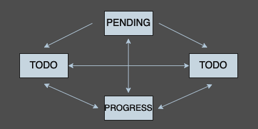

# TODO 서비스 구현

## 개발환경
- JDK 17
- SpringBoot 3
- Kotlin
- H2

## 패키지 구조
- 도메인 (task, user)
    - 도메인 별로 controller, service, repository, dto 구분
- global(환경설정 또는 공용 코드)
    - commonVal
        - 공통 변수
    - configuration
        - bean 정의 등의 설정파일
    - exception
        - 예외처리 (4XX, 500)

## 구현 참고 사항
- RequestDTO 검증을 위한 @Validated, @Valid 적용
- 상태 변경 처리를 위해 상태 패턴 적용 (예외 발생 시 BadRequest)
- Request 의 성공, 실패 여부와 무관한 동일한 응답 포멧 사용(ApiResponse)
- 테스트 코드 작성

## Table
- user
- task
- taskHistory

## API 정의
### [user]
#### 1. 회원 가입
> [POST] /auth/sign-up
- loginId 로 중복 체크
- 중복시 예외 발생 (BadRequest)
- 미등록 아이디라면 회원 등록
- 사용자 비밀번호는 암호화

#### 2. 회원 탈퇴
> [DELETE] /auth/withdrawal/{loginId}
- loginId 로 사용자 조회
- 사용자 조회 안되면 예외 발생 (BadRequest)
- DB 에서 삭제하지 않고 isDeleted 컬럼 수정
- 수정이더라도 API 의 용도는 삭제이므로 DELETE 메소드 사용

#### 3. 로그인
> [POST] /auth/sign-in
- loginId, 비밀번호 검증 후 로그인 처리
- 구현 단순화를 위해 JWT 사용X

### [task]
#### 1. 할 일 등록
> [POST] /task
- 사용자 조회 후 할 일 등록
- 사용자 조회 안되면 예외 발생 (BadRequest)

#### 2. 최근에 등록한 할 일 1건 조회
> [GET] /task/{loginId}/last-added
- 사용자 조회 후 마지막 task 조회
- 사용자 조회 안되면 예외 발생 (BadRequest)
- task 정보와, task 의 상태 변경 히스토리 정보 반환

#### 3. 할 일 목록 조회
> [GET] /task/{loginId}/due-date/{start}/{end}
- 사용자 조회 후 dueDate 기준으로 between 조회
- 사용자 조회 안되면 예외 발생 (BadRequest)

#### 4. 할 일 상태 변경
> [PUT] /task/{loginId}/due-date/{start}/{end}

- 제약 조건 
  - PENDING, PROGRESS 일 때는 어떤 상태로도 변경이 가능하다
  - TODO, DONE 은 PENDING 을 제외한 모든 상태로 변경이 가능하다
- 상태에 따라 동작 행위가 달라지기때문에 State Pattern 으로 구현
